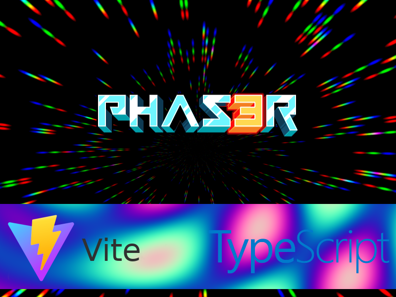

# Phaser 3 TypeScript Project Template with Vite

This quick-start project template combines [Phaser 3.55.2](https://github.com/photonstorm/phaser) with [TypeScript 4](https://www.typescriptlang.org/) and uses [Vite](https://vitejs.dev/) for bundling.

## Requirements

[Node.js](https://nodejs.org) is required to install dependencies and run scripts via `npm`.

## Available Commands

| Command | Description |
|---------|-------------|
| `npm install` | Install project dependencies |
| `npm run dev` | Run project, open web server and watch for changes |
| `npm run preview` | Build project with production settings and open web server |
| `npm run build` | Build code bundle with production settings (minification, source maps, etc..) |

## Writing Code

After cloning the repo, run `npm install` from your project directory. Then, you can start the local development
server by running `npm run dev`. The first time you run this you should see the following demo run:

After starting the development server with `npm run dev`, you can edit any files in the `src` folder
and Vite will automatically recompile and reload your server (available at `http://127.0.0.1:5173/`
by default).

## Configuring Vite

* Edit the file `vite.config.ts` to edit the distribution build.
